# Computer Vision Image Processor


## Table of Contents

1. [Project Overview](#1-project-overview)
2. [Architecture & Design Pattern](#2-architecture--design-pattern)
3. [Component Breakdown](#3-component-breakdown)
4. [Data Structures & Memory Model](#4-data-structures--memory-model)
5. [Algorithm Deep-Dive](#5-algorithm-deep-dive)
   - 5.1 [Edge Detection](#51-edge-detection)
   - 5.2 [Histogram Operations](#52-histogram-operations)
   - 5.3 [Noise Synthesis](#53-noise-synthesis)
   - 5.4 [Spatial Low-Pass Filters](#54-spatial-low-pass-filters)
   - 5.5 [FFT-Based Frequency-Domain Filters](#55-fft-based-frequency-domain-filters)
   - 5.6 [Hybrid Image Composition](#56-hybrid-image-composition)
6. [History & Undo System](#6-history--undo-system)
7. [Live Histogram Panel](#7-live-histogram-panel)
8. [Test Cases with Visual Results](#8-test-cases-with-visual-results)
   - 8.1 [Edge Detection Tests](#81-edge-detection-tests)
   - 8.2 [Noise Tests](#82-noise-tests)
   - 8.3 [Histogram Tests](#83-histogram-tests)
   - 8.4 [Frequency Filter Tests](#84-frequency-filter-tests)
   - 8.5 [Hybrid Image Test](#85-hybrid-image-test)
9. [Build & Run Instructions](#9-build--run-instructions)
10. [Developer Notes & Golden Rules](#10-developer-notes--golden-rules)

---

## 1. Project Overview

This application is a specialized image processing workbench built in **C++17** using **wxWidgets** for the GUI, **FFTW3** for Fast Fourier Transform operations, and **OpenCV** for Canny edge detection and noise RNG.

**Key capabilities:**

| Category | Features |
|---|---|
| Edge Detection | Sobel, Roberts, Prewitt (manual), Canny (OpenCV) |
| Histogram | Equalization, Normalization, Live CDF display |
| Noise Addition | Uniform, Gaussian, Salt & Pepper |
| Spatial Filtering | Average (Box), Gaussian, Median |
| Frequency Filtering | FFT Low-Pass, High-Pass, Band-Pass, Band-Stop |
| Hybrid Image | FFT-based multi-image fusion (Ideal / Gaussian) |
| Undo History | Branchless snapshot stack |

---

## 2. Architecture & Design Pattern

The project follows a **Modified MVC (Model-View-Controller)** pattern adapted for wxWidgets's event-driven loop.

```
┌─────────────────────────────────────────────────────────────────┐
│                          Application                            │
│   ┌──────────┐    spawns    ┌───────────────────────────────┐   │
│   │ MainFrame│ ──────────▶  │          ImageFrame           │   │
│   │          │              │  ┌─────────┐  ┌────────────┐  │   │
│   │ Upload   │              │  │ImagePanel│  │HistogramPnl│  │   │
│   │ Hybrid   │              │  │ (View)  │  │  (View)    │  │   │
│   └──────────┘              │  └────┬────┘  └────────────┘  │   │
│                             │       │  calls                 │   │
│                             │  ┌────▼──────────────────────┐│   │
│                             │  │     Filtering (Engine)    ││   │
│                             │  │  stateless static methods ││   │
│                             │  └───────────────────────────┘│   │
│                             └───────────────────────────────┘   │
└─────────────────────────────────────────────────────────────────┘
```

**Separation of concerns:**

- **Model:** `Filtering` class — pure algorithmic logic, no UI dependencies.
- **View:** `ImagePanel`, `HistogramPanel` — render pixels, draw histograms.
- **Controller:** `ImageFrame` — routes toolbar events → `Filtering` → `ImagePanel`.

---

## 3. Component Breakdown

### `App` (`App.h` / `App.cpp`)

The main `wxApp` subclass. Contains `OnInit()` which creates and shows the `MainFrame`. Entry point via `wxIMPLEMENT_APP(App)`.

### `MainFrame` (`MainFrame.h` / `MainFrame.cpp`)

The launcher window. Provides two actions:
- **Upload Images** — opens a multi-selection `wxFileDialog`; each path spawns an `ImageFrame`.
- **Hybrid Image** — a guided three-step flow: pick Image A → pick Image B → configure parameters (role, filter type, cutoff frequencies) → compute and display result.

### `ImageFrame` (`ImageFrame.h` / `ImageFrame.cpp`)

The core editing window. Contains:
- A **horizontal toolbar** with all filter actions.
- An **`ImagePanel`** (centre, 3 parts) for rendering.
- A **right sidebar** (1 part) with live `HistogramPanel` and history `wxListBox`.

On every filter action, `ImageFrame`:
1. Calls the appropriate `Filtering::*` static method.
2. Calls `m_imagePanel->SetImage(result)`.
3. Calls `RefreshHistogram()` to update the sidebar.
4. Calls `PushHistory(label)` to log the snapshot.

### `ImagePanel` (`ImagePanel.h` / `ImagePanel.cpp`)

A `wxPanel` rendering subclass. Stores a `wxImage` (the working pixel buffer) and a `wxBitmap` (the display-resolution scaled version). On `EVT_SIZE`, it recomputes `m_scaledBitmap` preserving aspect ratio. On `EVT_PAINT`, it blits the bitmap centred in the panel.

### `HistogramPanel` (`HistogramPanel.h` / `HistogramPanel.cpp`)

Draws a live bar chart of per-channel R, G, B intensity frequencies (0–255) and overlays the smoothed CDF curve. Called via `Update(newImage)` after each filter action.

### `HistogramFrame` (`HistogramFrame.h` / `HistogramFrame.cpp`)

A standalone `wxFrame` wrapper that hosts a `HistogramPanel` as a popup when the user clicks the "Histogram" toolbar button.

### `Filtering` (`Filtering.h` / `Filtering.cpp`)

The algorithm engine — **1 082 lines** of pure C++ math. All methods are `static`. Accepts `const wxImage&` and returns a new `wxImage`. Never touches UI.

**Dependencies:**
- `<fftw3.h>` — FFT forward/inverse transforms.
- `<opencv2/opencv.hpp>` — Canny edge detection, colour conversions.
- `<cmath>`, `<algorithm>`, `<random>`, `<vector>` — standard library.

---

## 4. Data Structures & Memory Model

### Pixel Buffer

`wxImage` stores pixels as a contiguous `unsigned char*` in **RGB-interleaved** format:

```
Index:   0   1   2   3   4   5   6   7   8  ...
Channel: R0  G0  B0  R1  G1  B1  R2  G2  B2 ...
```

Access formula for pixel `(x, y)` in an image of `width` W:
```
base_index = (y * W + x) * 3
R = data[base_index]
G = data[base_index + 1]
B = data[base_index + 2]
```

### Clamp Helper

All arithmetic on pixel values uses:

```cpp
static inline unsigned char Clamp(int v) {
    return static_cast<unsigned char>(v < 0 ? 0 : v > 255 ? 255 : v);
}
```

This prevents overflow/underflow without branchy if-chains.

### FFT Buffers (FFTW)

FFT operations allocate FFTW-aligned complex arrays:

```cpp
fftw_complex* in       = fftw_malloc(sizeof(fftw_complex) * N); // input
fftw_complex* out      = fftw_malloc(sizeof(fftw_complex) * N); // spectrum
fftw_complex* filtered = fftw_malloc(sizeof(fftw_complex) * N); // masked spectrum
```

`fftw_complex` is `double[2]` — index `[0]` = real part, `[1]` = imaginary part.

After the inverse FFT, the result is divided by `N` because **FFTW is unnormalised**:

```
IDFT output[i] = (sum of spectrum) → must divide by N to recover original scale
```

### History Stack

```cpp
std::vector<wxImage>   m_historyImages;  // deep copies of pixel buffers
std::vector<wxString>  m_historyLabels;  // human-readable filter names
```

The `wxListBox` mirrors these vectors. Selection of an older entry truncates future entries (branchless undo).

---

## 5. Algorithm Deep-Dive

### 5.1 Edge Detection

#### Sobel (manual convolution)

Sobel uses two 3×3 kernels to approximate the horizontal ($G_x$) and vertical ($G_y$) image gradients:

$$G_x = \begin{bmatrix} -1 & 0 & 1 \\ -2 & 0 & 2 \\ -1 & 0 & 1 \end{bmatrix}, \quad G_y = \begin{bmatrix} -1 & -2 & -1 \\ 0 & 0 & 0 \\ 1 & 2 & 1 \end{bmatrix}$$

Magnitude:
$$|G| = \sqrt{G_x^2 + G_y^2}$$

Clamped to $[0, 255]$ and stored in a grayscale image.

#### Roberts Cross (manual)

Diagonal 2×2 difference operators:

$$G_x = p_{(x,y)} - p_{(x+1,y+1)}, \quad G_y = p_{(x+1,y)} - p_{(x,y+1)}$$

Sensitive to diagonal edges; computationally minimal.

#### Prewitt (manual)

Same framework as Sobel but equal weights — no centre-pixel emphasis:

$$G_x = \begin{bmatrix} -1 & 0 & 1 \\ -1 & 0 & 1 \\ -1 & 0 & 1 \end{bmatrix}, \quad G_y = \begin{bmatrix} -1 & -1 & -1 \\ 0 & 0 & 0 \\ 1 & 1 & 1 \end{bmatrix}$$

#### Canny (OpenCV)

Multi-stage algorithm:
1. Gaussian blur (5×5, σ=1.4) — suppresses noise.
2. Sobel gradient computation.
3. Non-maximum suppression — thins edges to 1-pixel width.
4. Double thresholding (low=50, high=150) + hysteresis — removes weak/false edges.

---

### 5.2 Histogram Operations

#### Equalization

**Goal:** Redistribute intensity values to maximise contrast.

**Steps:**

1. Compute histogram $h[i]$ — count of pixels with intensity $i$.
2. Build CDF: $\text{cdf}[i] = \sum_{j=0}^{i} h[j]$
3. Build LUT: $\text{lut}[i] = \text{round}\!\left(\dfrac{\text{cdf}[i]}{n} \times 255\right)$
4. Apply LUT to every pixel.

Where $n$ = total pixel count.

#### Normalization (Contrast Stretching)

**Goal:** Linearly map $[\min, \max]$ of current intensities to $[0, 255]$.

$$\text{out}[i] = \text{round}\!\left(\dfrac{v - v_{\min}}{v_{\max} - v_{\min}} \times 255\right)$$

---

### 5.3 Noise Synthesis

#### Uniform Noise

For each channel byte, adds a random integer in $[\text{low},\, \text{high}]$ using `std::uniform_int_distribution`.

```
new_pixel = Clamp(old_pixel + rand(low, high))
```

#### Gaussian Noise

Uses `std::normal_distribution<double>(mean, stddev)` to generate per-channel offsets drawn from $\mathcal{N}(\mu, \sigma^2)$.

#### Salt & Pepper Noise

Randomly selects `density × W × H` pixel positions, sets half to 255 (salt) and half to 0 (pepper) across all three channels simultaneously.

---

### 5.4 Spatial Low-Pass Filters

All three share the `ApplyKernel()` helper that uses **clamp-to-edge padding** for border pixels.

#### Average (Box) Filter

Kernel: uniform $k \times k$ matrix with all weights = $\dfrac{1}{k^2}$.

#### Gaussian Filter

Kernel built analytically from:
$$K(x,y) = e^{-\dfrac{x^2 + y^2}{2\sigma^2}}$$

Normalised so all weights sum to 1. Result: smooth blur without ringing.

#### Median Filter

For each pixel, collects the $k \times k$ neighbourhood into three separate vectors (R, G, B), sorts them, and takes the middle element. Effective at removing salt-and-pepper noise while preserving sharp edges.

---

### 5.5 FFT-Based Frequency-Domain Filters

**Pipeline for all FFT filters:**

```
    wxImage (spatial)
         │
         ▼  ImageToDoubleArray()
    double[] grayscale values
         │
         ▼  fftw_plan_dft_2d (FORWARD)
    fftw_complex[] spectrum F(u,v)
         │
         ▼  Apply transfer function H(u,v)
    fftw_complex[] filtered G(u,v) = F(u,v) · H(u,v)
         │
         ▼  fftw_plan_dft_2d (BACKWARD)
    double[] spatial result / N
         │
         ▼  DoubleArrayToImage() → normalise [0,255]
    wxImage (filtered)
```

**Frequency coordinate system (FFTW layout):**

FFTW places DC at index (0,0). To compute the true distance from DC:

```cpp
int fx = (x <= width/2)  ? x : x - width;
int fy = (y <= height/2) ? y : y - height;
double D = sqrt(fx*fx + fy*fy);
```

#### Low-Pass Filter Transfer Functions

| Type | Formula |
|---|---|
| Ideal | $H = 1$ if $D \leq D_0$, else $0$ |
| Gaussian | $H = e^{-D^2 / (2D_0^2)}$ |

Small $D_0$ → narrow passband → blurrier image.

#### High-Pass Filter Transfer Functions

| Type | Formula |
|---|---|
| Ideal | $H = 0$ if $D \leq D_0$, else $1$ |
| Gaussian | $H = 1 - e^{-D^2 / (2D_0^2)}$ |

High-pass naturally zeros the DC component ($D=0 \Rightarrow H=0$), so flat regions become dark in the output.

#### Band-Pass Filter

Passes only frequencies in $[D_{\text{low}},\, D_{\text{high}}]$:

$$H = \begin{cases} 1 & D_{\text{low}} \leq D \leq D_{\text{high}} \\ 0 & \text{otherwise} \end{cases}$$

#### Band-Stop (Notch) Filter

Complement of band-pass — rejects frequencies in range, useful for removing periodic noise:

$$H = \begin{cases} 0 & D_{\text{low}} \leq D \leq D_{\text{high}} \\ 1 & \text{otherwise} \end{cases}$$

---

### 5.6 Hybrid Image Composition

**Concept:** At close viewing distance, the human visual system perceives high-frequency detail. At far distance, low-frequency structure dominates. A hybrid image exploits this by combining:

$$\text{Hybrid} = \text{LowPass}(\text{Image A},\, D_{\text{low}}) + \text{HighPass}(\text{Image B},\, D_{\text{high}})$$

**Implementation steps:**

1. Resize Image B to dimensions of Image A.
2. Apply `FilterLowFreqFFT(lowSrc, lowCutoff, filterType)` → `lowPart`.
3. Apply `FilterHighFreqFFT(highSrc, highCutoff, filterType)` → `highPart`.
4. Blend pixel-by-pixel:

```cpp
for (long i = 0; i < n; ++i) {
    int val = (int)lpData[i] + (int)hpData[i];
    dst[i] = Clamp(val);
}
```

**UI parameters exposed to user:**

| Parameter | Default | Description |
|---|---|---|
| Role | A=Low, B=High | Which image contributes low/high frequencies |
| Filter type | Gaussian | Ideal (hard cutoff) or Gaussian (smooth) |
| Low cutoff | 30 px | Radius of low-pass passband |
| High cutoff | 60 px | Radius of high-pass passband |

---

## 6. History & Undo System

```
Timeline:  Original → Filter1 → Filter2 → Filter3
                                    ↑
                           User selects here
                           and applies Filter4
                                    ↓
New Timeline: Original → Filter1 → Filter2 → Filter4
```

`PushHistory(label)` detects mid-stack selection and **truncates the future branch** before appending the new snapshot. This prevents logical inconsistencies (cannot "undo" to a state that was derived from a different edit path).

```cpp
if (currentIdx < m_historyImages.size() - 1) {
    // Erase everything after currentIdx
    m_historyImages.erase(begin + currentIdx + 1, end);
    m_historyLabels.erase(begin + currentIdx + 1, end);
    // Rebuild listbox to reflect truncation
}
m_historyImages.push_back(snapshot.Copy());
```

---

## 7. Live Histogram Panel

The `HistogramPanel` re-renders on every `Update()` call:

1. **Count frequencies:** For each pixel, increment `hist[R]++`, `hist[G]++`, `hist[B]++`.
2. **Find peak:** `maxCount = max(hist[0..255])`.
3. **Draw bars:** Normalise bar height to panel height. Red, green, blue bars side-by-side per intensity value.
4. **Draw CDF:** Smooth the histogram with a sliding window of ±5, accumulate, and draw as a white overlay curve.

The panel's minimum size is set to 220×220 px; it grows proportionally in full-screen mode alongside the sidebar's flex sizer.

---

## 8. Test Cases with Visual Results

### 8.1 Edge Detection Tests


**Sobel Edge Detection** — detects both horizontal and vertical edges with strong central weighting:

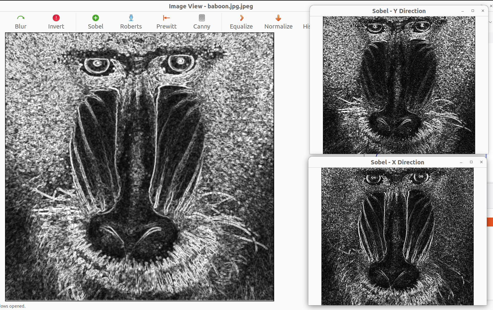

---

**Prewitt Edge Detection** — similar to Sobel but with uniform kernel weights, slightly less noise-robust:

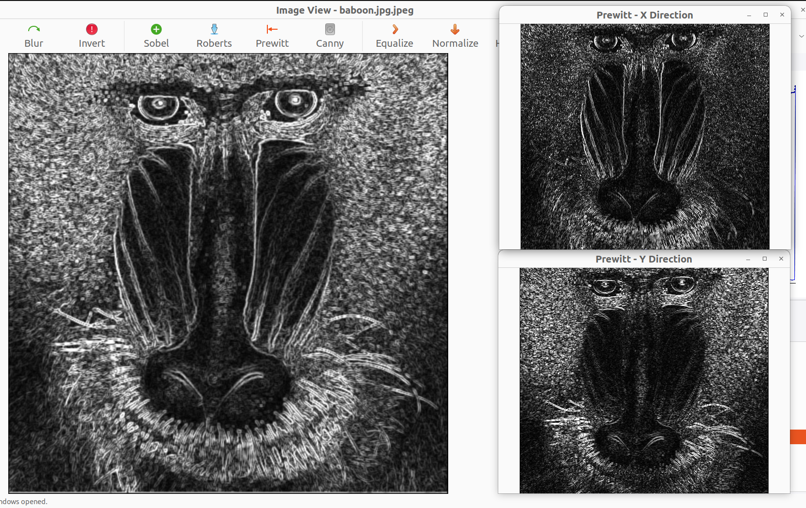

---

**Roberts Cross Edge Detection** — diagonal difference operator, very sharp but sensitive to noise:

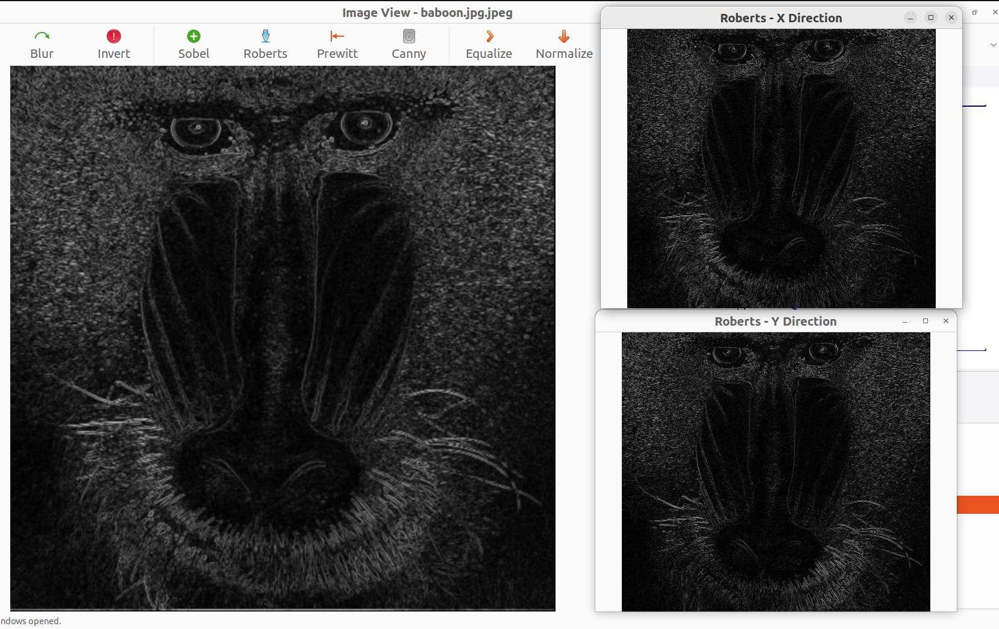

---

**Canny Edge Detection (OpenCV)** — multi-stage pipeline produces clean, thin, connected edges:

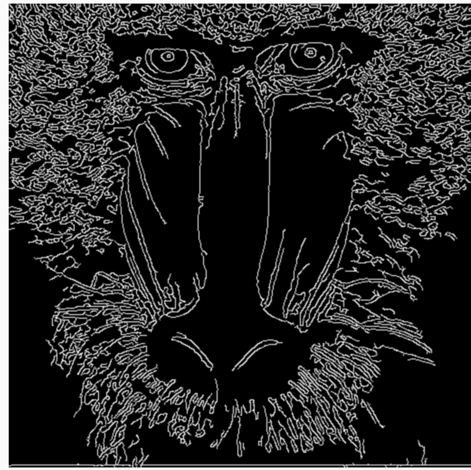

---

### 8.2 Noise Tests

**Original Image (no noise):**


---

**Uniform Noise** — adds a uniformly distributed random offset $\in [\text{low}, \text{high}]$ to each channel:


---

**Gaussian Noise** — adds noise drawn from $\mathcal{N}(\mu, \sigma^2)$; higher $\sigma$ produces more severe degradation:

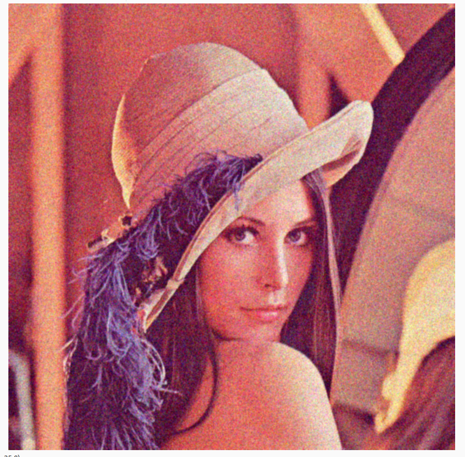

---

**Salt & Pepper Noise** — randomly sets a fraction of pixels to pure white (255) or pure black (0):


---

### 8.3 Histogram Tests

**RGB Histogram** — displays per-channel (R, G, B) intensity distribution with CDF overlay:

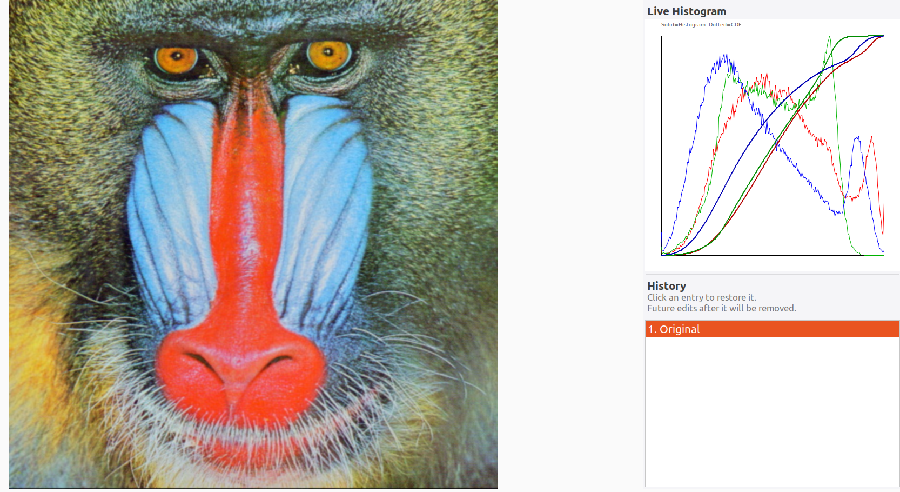

---

**Grayscale Histogram** — single-channel intensity distribution after grayscale conversion:

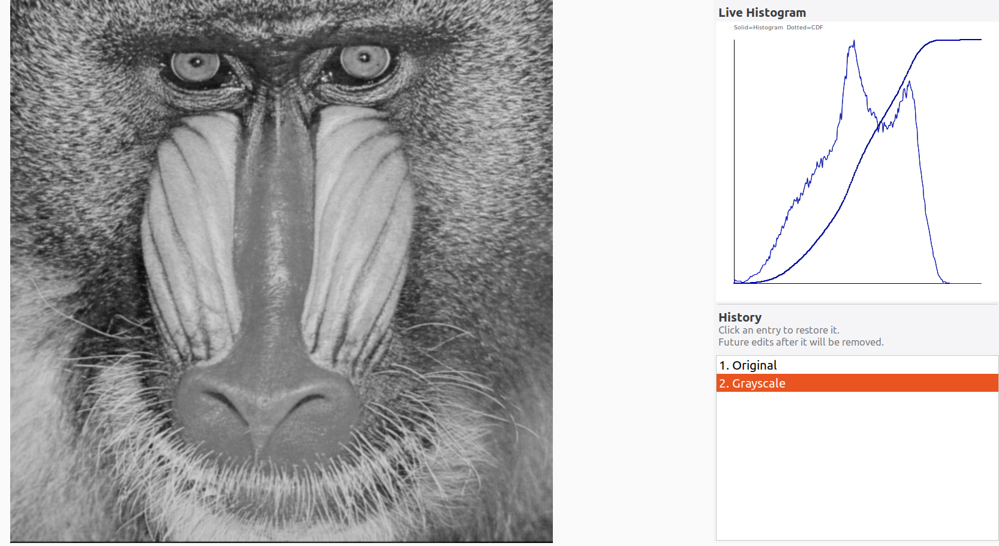

---

**Equalization** — before (low-contrast) vs. after equalization (enhanced contrast):

| Before | After |
|--------|-------|
| 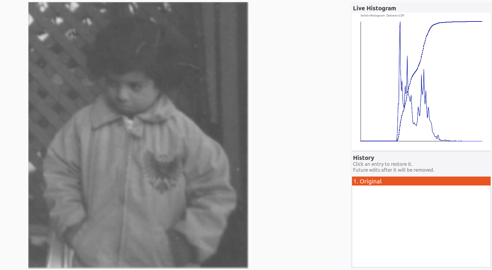 | 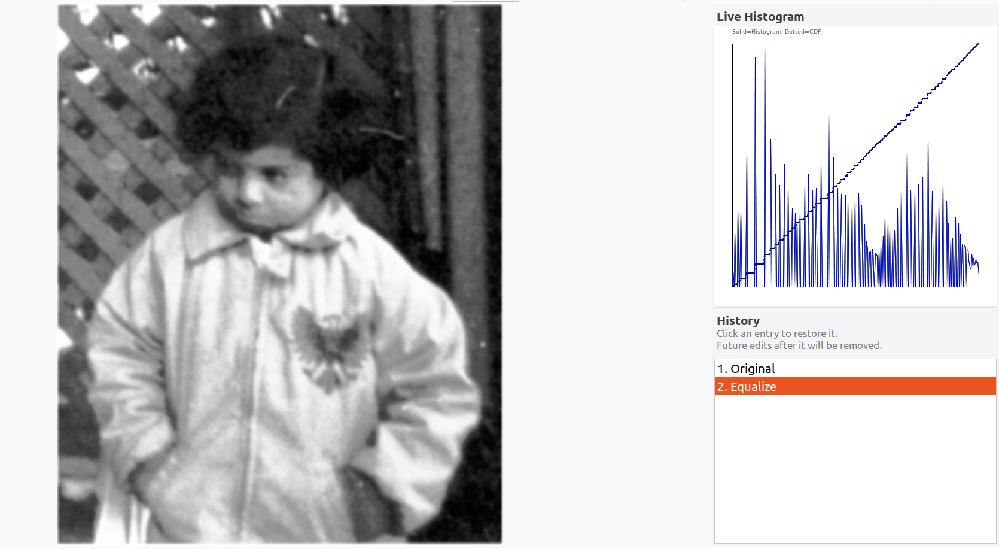 |

The CDF mapping redistributes pixel intensities to be as uniform as possible, visually "stretching" the contrast across the full 0–255 range.

---

### 8.4 Frequency Filter Tests

**Low-Pass FFT Filter** (Gaussian, $D_0 = 30$) — removes high-frequency details, resulting in smooth blur while preserving overall structure:


---

**High-Pass FFT Filter** (Gaussian, $D_0 = 30$) — removes low-frequency content, leaving only fine edges and textures; flat regions appear dark:


---

### 8.5 Hybrid Image Test

**Source Image A** (contributes low-frequency content — viewed from far away):


**Source Image B** (contributes high-frequency content — visible up close):

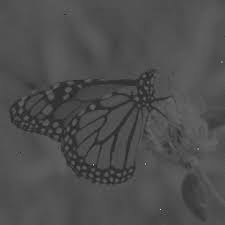

**Hybrid Result:**

$$\text{Hybrid} = \text{LowPass}(A,\; D_0 = 30) + \text{HighPass}(B,\; D_0 = 60)$$

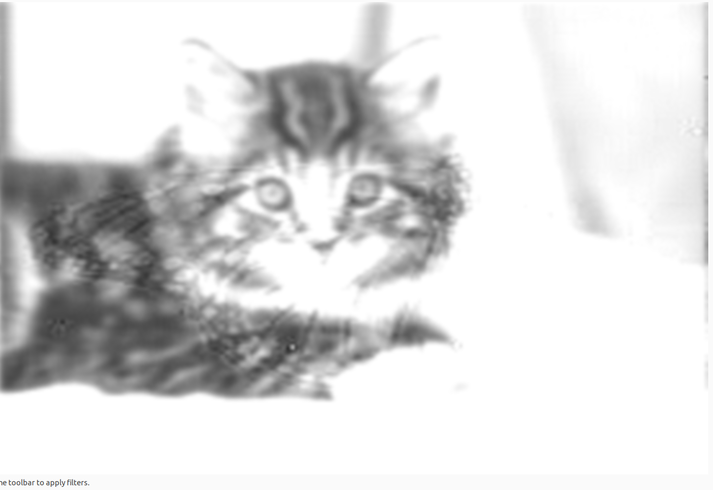

> **How to observe:** View the hybrid image from a normal screen distance to see Image B's fine details. Step back or squint to see Image A's overall structure emerge.

---

## 9. Build & Run Instructions

### Prerequisites

| Dependency | Ubuntu/Debian Install |
|---|---|
| C++17 compiler (GCC / Clang) | `sudo apt install build-essential` |
| CMake ≥ 3.10 | `sudo apt install cmake` |
| wxWidgets 3.0+ | `sudo apt install libwxgtk3.0-gtk3-dev` |
| OpenCV | `sudo apt install libopencv-dev` |
| FFTW3 | `sudo apt install libfftw3-dev` |

### Build

```bash
git clone https://github.com/youssefdaoud133/Computer-Vision-ImageProcessor.git
cd Computer-Vision-ImageProcessor
cmake -B build
cmake --build build
```

### Run

```bash
./build/ImageProcessor
```

### Using the Application

1. **Upload Images** — click "Upload Images", select one or more files; each opens in a dedicated window.
2. **Apply Filters** — use toolbar buttons in any `ImageFrame`.
3. **Undo** — select any previous entry in the History sidebar to restore that state.
4. **Hybrid Image** — click "Hybrid Image" on the main window, follow the three-step guided flow.

---

## 10. Developer Notes & Golden Rules

1. **Strictly ASCII in UI strings** — avoid Unicode symbols (σ, etc.) in `wxString::Format()`. Some Linux locales cause library-level crashes on non-ASCII format strings.

2. **Stateless Filtering** — all algorithm logic stays in `Filtering.cpp` with no UI references. UI logic stays in `ImageFrame.cpp`. Never mix.

3. **Always deep-copy before modifying** — use `image.Copy()` before calling `image.GetData()` in any write path. `wxImage` is reference-counted; modifying shared data corrupts history snapshots.

4. **FFTW normalisation** — FFTW's IDFT does NOT normalise by N automatically. Always divide output by N:
   ```cpp
   resultData[i] = in[i][0] / N;
   ```

5. **Memory cleanup order (FFTW)** — always destroy plans before freeing buffers:
   ```cpp
   fftw_destroy_plan(forward);
   fftw_destroy_plan(inverse);
   fftw_free(in);
   fftw_free(out);
   fftw_free(filtered);
   ```

6. **After every filter** — call both `RefreshHistogram()` and `PushHistory()` to keep sidebar and undo stack in sync.

7. **Odd kernel sizes** — all spatial convolution kernels must be odd-sized. Both `FilterGaussian` and `FilterMedian` enforce this with `if (kernelSize % 2 == 0) kernelSize++`.

---

*Documentation prepared by the team — SBME Computer Vision, Task 1 — March 2026.*
